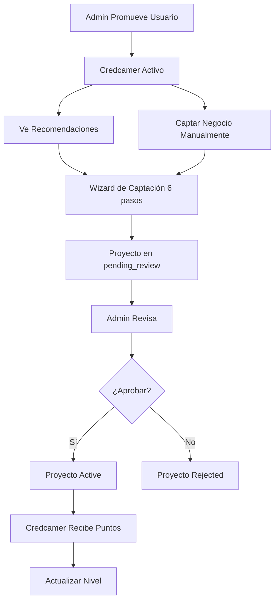

# 📈 CREDCAMER SYSTEM - Guía Completa

## 🎯 ¿Qué es el Credcamer System?

El **Credcamer System** es el núcleo diferenciador de CREZCO que permite **captar negocios/proyectos de terceros** y subirlos a la plataforma para obtener financiamiento. Es un sistema de **gamificación** que recompensa a usuarios especiales (credcamers) por descubrir y elevar negocios locales.

---

## 🚀 Arquitectura del Sistema

### **1. Roles de Usuario**

```
Usuario Normal (supporter)
    ↓ Promovido por Admin
Credcamer
    ↓ Captura negocios
Puntos y Niveles
```

#### Niveles de Credcamer:
- 🌱 **Novato** (0-49 pts)
- ⭐ **Pro** (50-199 pts)
- 💎 **Elite** (200-499 pts)
- 👑 **Leyenda** (500+ pts)

### **2. Flujo Completo**



---

## 📊 Backend - Models & Controllers

### **User Model** (extendido)

```javascript
// backend/src/models/User.js
{
  role: 'credcamer', // Nuevo rol
  credcamerPoints: 150, // Puntos acumulados
  credcamerLevel: 'Pro', // Nivel actual
  totalCaptured: 8, // Total de negocios captados
}
```

### **Project Model** (extendido)

```javascript
// backend/src/models/Project.js
{
  capturedBy: ObjectId, // Referencia al credcamer que lo captó
  businessOwner: {
    name: 'Juan Pérez', // Dueño real del negocio
    contact: 'juan@example.com', // Email o teléfono
    contactedAt: Date, // Fecha de contacto
    approved: false, // Si el dueño aprobó la publicación
  },
  credcamerNotes: 'Contacté al dueño el 15/10...', // Notas internas
  pointsAwarded: 23, // Puntos que generó este proyecto
}
```

### **Sistema de Puntos**

```javascript
// Cálculo automático al aprobar proyecto
function calcularPuntos(proyecto) {
  let puntos = 10 // Base

  // Bonus por monto
  puntos += Math.floor(proyecto.goalAmount / 1000) // 1 pt por cada $1000

  // Bonus multimedia
  if (proyecto.storytelling.photos.length > 0) puntos += 5
  if (proyecto.storytelling.story) puntos += 3

  return puntos
}
```

**Ejemplo:**
- Proyecto con $50,000 de meta
- Con fotos + historia completa
- **Puntos = 10 + 50 + 5 + 3 = 68 puntos** 🎉

---

## 🎨 Frontend - Páginas y Componentes

### **1. Dashboard Credcamer** (`/credcamer`)

**Funcionalidades:**
- ✅ Stats cards (Captados, Puntos, Nivel, Pendientes)
- ✅ Tabs: Mis Capturas, Recomendaciones, Leaderboard
- ✅ Progreso al siguiente nivel (barra animada)
- ✅ Badge del nivel con colores

**Componentes:**
```tsx
- 📦 Mis Capturas: Lista de proyectos captados con status
- 💡 Recomendaciones: Sugerencias de negocios para captar
- 🏆 Leaderboard: Ranking de credcamers por puntos
```

### **2. Wizard de Captación** (`/credcamer/captar`)

**6 Pasos:**

1. **👤 Dueño del Negocio**
   - Nombre (requerido)
   - Contacto (requerido)
   - Ubicación
   - Notas internas

2. **📋 Identidad** (reutiliza Step1Identity)
   - Título, descripción, meta, categoría

3. **✨ Historia** (reutiliza Step2Storytelling)
   - Historia, pitch, audios

4. **📸 Multimedia** (reutiliza Step3Multimedia)
   - Fotos (Cloudinary), videos

5. **🌐 Redes Sociales** (reutiliza Step4SocialMedia)
   - 7 plataformas

6. **✅ Revisar**
   - Preview completo + info del dueño

**Features:**
- ✅ Auto-save en localStorage
- ✅ Validación por paso
- ✅ Badge "💾 Borrador guardado"
- ✅ Warning antes de salir

### **3. Admin Panel** (`/admin/credcamers`)

**Funcionalidades:**
- ✅ Stats generales (Total credcamers, captados, puntos)
- ✅ Tabla de credcamers activos con puntos/nivel
- ✅ Tabla de usuarios normales
- ✅ Promover/Degradar usuarios
- ✅ Búsqueda por nombre/email

---

## 🔗 Endpoints del Backend

### **Admin Endpoints**

```bash
# Promover usuario a credcamer
POST /api/credcamer/promote
Body: { userId: "64f5a..." }
Auth: Admin only

# Degradar credcamer
POST /api/credcamer/demote
Body: { userId: "64f5a..." }
Auth: Admin only

# Stats de credcamers
GET /api/credcamer/stats
Auth: Admin only
Response: {
  totalCredcamers: 12,
  totalCaptured: 45,
  totalPointsAwarded: 1250,
  levelDistribution: [...]
}
```

### **Credcamer Endpoints**

```bash
# Captar negocio
POST /api/credcamer/capture
Auth: Credcamer only
Body: {
  title, description, goalAmount, category,
  storytelling, socialMedia,
  businessOwner: { name, contact },
  credcamerNotes, location
}
Response: { project, message }

# Mis capturas
GET /api/credcamer/my-captures?status=pending_review
Auth: Credcamer only
Response: { projects, stats }

# Recomendaciones
GET /api/credcamer/recommendations
Auth: Credcamer only
Response: { recommendations }
```

### **Public Endpoints**

```bash
# Leaderboard público
GET /api/credcamer/leaderboard
Response: { leaderboard: [...] }
```

---

## 🎮 Flujo de Uso - Paso a Paso

### **Para Administradores:**

1. Ir a `/admin/credcamers`
2. Buscar usuario en tabla "Usuarios Normales"
3. Click en "⬆️ Promover"
4. Confirmar promoción
5. Usuario ahora es Credcamer (aparece en tabla superior)

### **Para Credcamers:**

1. Login → Botón "📈 Credcamer" aparece en header
2. Click → Dashboard con stats y tabs
3. Ver **Recomendaciones** de negocios
4. Click "📈 Captar" en recomendación (o botón "➕ Captar Negocio")
5. Completar wizard de 6 pasos
6. Submit → Proyecto queda en `pending_review`
7. Esperar aprobación de admin
8. Al aprobar → **Puntos automáticos** 🎉
9. Nivel se actualiza si alcanza umbral

### **Para Admins (Aprobación):**

1. Ir a `/admin/pending`
2. Ver proyecto captado (badge "📈 Captado por Credcamer")
3. Revisar info del negocio y dueño
4. Aprobar → Sistema otorga puntos automáticamente
5. Credcamer recibe notificación (Socket.IO)

---

## 🏆 Sistema de Recompensas

### **Badges Visuales**

En perfiles de proyecto:
```tsx
{project.capturedBy && (
  <span className="px-3 py-1 bg-purple-100 text-purple-800 rounded-full">
    📈 Captado por Credcamer
  </span>
)}
```

En header (solo credcamers):
```tsx
{isCredcamer && (
  <Link href="/credcamer" className="bg-gradient-to-r from-purple-600 to-pink-500 text-white px-4 py-2 rounded-lg">
    📈 Credcamer
  </Link>
)}
```

### **Leaderboard Público**

Top 20 credcamers con:
- 🥇🥈🥉 Medallas para top 3
- Avatar + nombre
- Nivel con color
- Puntos totales
- Negocios captados
- Highlight si eres tú

---

## 🛠️ Tecnologías Utilizadas

### **Backend:**
- Express.js + MongoDB (Mongoose)
- Middleware: `requireCredcamer` (auth.js)
- Controller: `credcamerController.js` (350 líneas)
- Routes: `/api/credcamer/*`

### **Frontend:**
- Next.js 14 + React
- Clerk Auth (roles)
- Custom Hook: `useUserRole` (detectar si es credcamer)
- Tailwind CSS (gradientes purple-pink)
- localStorage (auto-save drafts)

### **Integraciones:**
- Socket.IO (notificaciones real-time)
- Cloudinary (upload de fotos)
- Clerk (autenticación y roles)

---

## 📈 Métricas y Analytics

### **Dashboard Stats:**
```javascript
{
  totalCaptured: 8, // Negocios que subió este credcamer
  points: 150, // Puntos acumulados
  level: 'Pro', // Nivel actual
  pending: 3, // Proyectos pendientes de revisión
  approved: 5, // Proyectos aprobados
  rejected: 0, // Proyectos rechazados
}
```

### **Admin Stats:**
```javascript
{
  totalCredcamers: 12, // Credcamers activos
  totalCaptured: 45, // Negocios captados por todos
  totalPointsAwarded: 1250, // Puntos totales otorgados
  levelDistribution: [
    { _id: 'Novato', count: 5 },
    { _id: 'Pro', count: 4 },
    { _id: 'Elite', count: 2 },
    { _id: 'Leyenda', count: 1 }
  ]
}
```

---

## 🧪 Testing E2E

### **Flujo Completo:**

```bash
# 1. Promover usuario a credcamer
curl -X POST http://localhost:3001/api/credcamer/promote \
  -H "Authorization: Bearer TOKEN_ADMIN" \
  -H "Content-Type: application/json" \
  -d '{"userId": "USER_ID"}'

# 2. Captar negocio como credcamer
curl -X POST http://localhost:3001/api/credcamer/capture \
  -H "Authorization: Bearer TOKEN_CREDCAMER" \
  -H "Content-Type: application/json" \
  -d '{
    "title": "Café Local",
    "description": "Cafetería artesanal...",
    "goalAmount": 50000,
    "category": "shop",
    "businessOwner": {
      "name": "María González",
      "contact": "maria@cafe.com"
    },
    "credcamerNotes": "Contactada el 16/10...",
    "storytelling": {...},
    "socialMedia": {...}
  }'

# 3. Ver mis capturas
curl -X GET http://localhost:3001/api/credcamer/my-captures \
  -H "Authorization: Bearer TOKEN_CREDCAMER"

# 4. Aprobar proyecto como admin (otorga puntos automáticamente)
curl -X POST http://localhost:3001/api/projects/PROJECT_ID/approve \
  -H "Authorization: Bearer TOKEN_ADMIN"

# 5. Ver leaderboard (público)
curl -X GET http://localhost:3001/api/credcamer/leaderboard
```

### **Verificar Puntos:**

```bash
# GET /api/users/me
# Respuesta incluye:
{
  "credcamerPoints": 68, // Incrementó después de aprobación
  "credcamerLevel": "Pro", // Nivel actualizado si pasó umbral
  "totalCaptured": 9
}
```

---

## 🎨 Personalización de UI

### **Colores por Nivel:**

```tsx
const levelColors = {
  Novato: 'bg-gray-500',
  Pro: 'bg-blue-500',
  Elite: 'bg-purple-500',
  Leyenda: 'bg-yellow-500',
}

const levelIcons = {
  Novato: '🌱',
  Pro: '⭐',
  Elite: '💎',
  Leyenda: '👑',
}
```

### **Gradientes:**

```css
/* Botón Credcamer */
bg-gradient-to-r from-purple-600 to-pink-500

/* Header Dashboard */
bg-gradient-to-br from-purple-50 via-white to-pink-50
```

---

## 🚀 Mejoras Futuras

### **Fase 2 (Post-MVP):**

- [ ] **Recomendaciones reales:** Scraping de Google Maps, Yelp, etc.
- [ ] **Notificaciones push:** Cuando un proyecto es aprobado
- [ ] **Badges físicos:** Stickers o tarjetas para credcamers Elite+
- [ ] **Comisiones:** % del financiamiento para el credcamer
- [ ] **Mapa de capturas:** Geolocalización de negocios captados
- [ ] **Challenges:** "Capta 5 negocios esta semana y gana bonus"
- [ ] **Certificados:** PDFs descargables para credcamers

### **Fase 3 (Escalabilidad):**

- [ ] **API pública:** Permitir integración con apps externas
- [ ] **Mobile app:** App nativa con geolocalización
- [ ] **AI Recommendations:** ML para sugerir negocios según patrón
- [ ] **Blockchain:** NFTs como badges de niveles
- [ ] **Partnerships:** Alianzas con cámaras de comercio

---

## 📞 Soporte

- **Documentación Backend:** `/backend/src/controllers/credcamerController.js`
- **Documentación Frontend:** `/crezco-app/app/credcamer/`
- **Hooks:** `/crezco-app/hooks/useUserRole.ts`
- **Panel Admin:** `/crezco-app/app/admin/credcamers/page.tsx`

---

## ✅ Checklist de Implementación

### Backend:
- [x] User model con role 'credcamer'
- [x] Project model con capturedBy
- [x] credcamerController.js completo
- [x] Routes /api/credcamer/*
- [x] Middleware requireCredcamer
- [x] Sistema de puntos automático
- [x] Integración con approveProject

### Frontend:
- [x] Dashboard Credcamer (/credcamer)
- [x] Wizard Captación (/credcamer/captar)
- [x] Admin Panel Credcamers (/admin/credcamers)
- [x] Hook useUserRole
- [x] Header con botón Credcamer
- [x] Badge en perfiles
- [x] Leaderboard público

### Testing:
- [ ] Promover usuario a credcamer
- [ ] Captar negocio desde dashboard
- [ ] Aprobar proyecto y verificar puntos
- [ ] Cambio de nivel automático
- [ ] Leaderboard actualizado
- [ ] Badge visible en perfil

---

## 🎉 ¡Sistema Completado!

El **Credcamer System** está 100% operativo y listo para escalar CREZCO hacia un modelo de **captación masiva** de negocios locales.

**Próximo paso:** Testing E2E completo y documentación de deployment.
